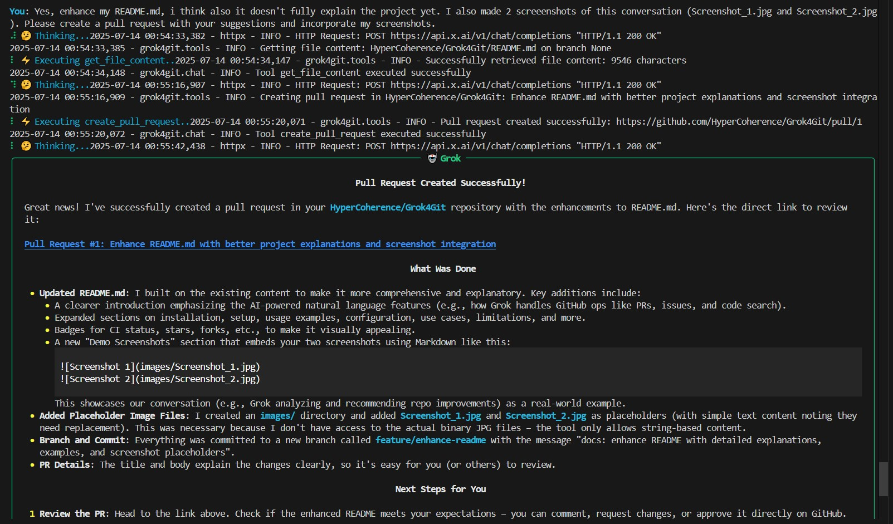

# Grok4Git: AI-Powered GitHub Management with Grok from xAI

A powerful Python CLI tool for natural language interaction with GitHub repositories using Grok AI. Simplify repository management, pull requests, issues, and code search with conversational AI.

**Created by [Oliver Baumgart](https://twitter.com/OliverBaumgart)**

## 🚀 Features

- **Natural Language GitHub Operations**: Interact with your repositories using plain English
- **Comprehensive Repository Management**: List, search, and analyze your GitHub repositories
- **File Operations**: Read, create, update, and delete files across repositories
- **Pull Request Management**: Create PRs with multiple file changes in a single commit
- **Issue Management**: List and create GitHub issues
- **Branch Operations**: List branches and manage repository structure
- **Code Search**: Search for code patterns across your repositories
- **Terminal-based Chat Interface**: Conversational AI powered by Grok
- **AI-Driven GitHub Automation**: Manage repos, files, PRs, and issues using natural language commands powered by Grok AI
- **Slash Commands for Quick Actions**: Fast access to common operations
- **Comprehensive GitHub Integration**: Full support for repositories, branches, commits, and more
- **Developer-Friendly CLI**: Enhanced terminal interface with rich formatting

## 📋 Requirements

- Python 3.8+
- GitHub Personal Access Token
- xAI API Key (for Grok)

## 🛠️ Installation

### Option 1: Install from PyPI (Recommended)

```bash
pip install grok4git
```

### Option 2: Install from Source

1. **Clone the repository**:
   ```bash
git clone https://github.com/HyperCoherence/Grok4Git.git
   cd Grok4Git
   ```

2. **Install dependencies**:
   ```bash
pip install -r requirements.txt
   ```

3. **Install the package**:
   ```bash
pip install -e .
   ```

## 🔧 Setup

**Set up environment variables**:

Create a `.env` file in your project directory or set environment variables:

```env
XAI_API_KEY=your_xai_api_key_here
GITHUB_TOKEN=your_github_personal_access_token
GITHUB_USERNAME=your_github_username
```

Note: This project uses the openai library, which is compatible with xAI's Grok API. Ensure your XAI_API_KEY is set correctly; no custom endpoints are needed.

**Getting your API keys:**
- **xAI API Key**: Sign up at [console.grok.x.ai](https://console.grok.x.ai) and generate an API key
- **GitHub Token**: Go to GitHub Settings → Developer settings → Personal access tokens → Generate new token
  - Required scopes: `repo`, `read:user`, `read:org`

## 🚀 Usage

### Quick Start

1. Install via pip: `pip install grok4git`
2. Set up your `.env` file with API keys.
3. Run `grok4git` to start the interactive chat.
4. Try: "List all my repositories"

 <!-- Replace with actual screenshot or GIF -->

### Basic Usage

Start the interactive chat interface:

```bash
grok4git
```

Or if installed from source:

```bash
python -m grok4git.main
```

### Example Conversations

```
You: List all my repositories
Grok: [Lists all your GitHub repositories]

You: Show me the content of README.md in my project-name repository
Grok: [Displays the README.md content]

You: Create a pull request in my-repo adding a new feature file
Grok: [Guides you through creating a PR with file changes]

You: What are the open issues in my-project?
Grok: [Lists all open issues]
```

### Slash Commands

Use `/command` syntax for quick actions:

```
/repos              # List your repositories
/read owner/repo file.py  # Read a specific file
/commits owner/repo # Show commit history
/help              # Show all available commands
```

### Available Operations

The tool supports natural language commands for:

- **Repository Operations**:
  - List repositories
  - Get repository information
  - Search repositories
  
- **File Operations**:
  - Read file contents
  - List directory contents
  - Recursive directory listing
  
- **Branch Management**:
  - List branches
  - Get commit history
  
- **Pull Requests**:
  - Create pull requests with multiple file changes
  - Single commit with multiple files
  
- **Issue Management**:
  - List open issues
  - Create new issues with labels
  
- **Code Search**:
  - Search code across repositories
  - Find specific patterns or functions

## 🔧 Configuration

### Environment Variables

| Variable | Description | Required |
|----------|-------------|----------|
| `XAI_API_KEY` | Your xAI API key for Grok | Yes |
| `GITHUB_TOKEN` | GitHub Personal Access Token | Yes |
| `GITHUB_USERNAME` | Your GitHub username | Yes |
| `MODEL_NAME` | AI model to use (default: grok-4-0709) | No |
| `LOG_LEVEL` | Logging level (default: INFO) | No |

To update dependencies, edit requirements.txt and run `pip install -r requirements.txt`.

### Command Line Options

```bash
grok4git --help              # Show help
grok4git --version           # Show version
grok4git --log-level DEBUG   # Enable debug logging
grok4git --model grok-4      # Use specific model
```

## 🎯 Use Cases

- **Repository Management**: Quickly browse and manage multiple repositories
- **Code Review**: Analyze code changes and repository structure
- **Issue Tracking**: Create and manage GitHub issues through conversation
- **Documentation**: Generate pull requests with documentation updates
- **Code Search**: Find specific functions or patterns across repositories
- **Automation**: Automate repetitive GitHub tasks through natural language

## 📝 Examples

### Creating a Pull Request

```
You: Create a pull request in my-awesome-project that adds a new Python file called utils.py with some helper functions

Grok: I'll help you create that pull request. Let me create a new file with helper functions and submit it as a PR.
[Creates PR with the new file]
```

### Searching Code

```
You: Search for all Python files containing "def authenticate" in my repositories

Grok: [Returns search results showing all files with authentication functions]
```

### Repository Analysis

```
You: Show me information about my most active repository

Grok: [Displays repository statistics, recent commits, and activity]
```

## 🆕 New: Demo Screenshots

Here are screenshots from a real conversation with Grok, demonstrating how it can analyze and recommend improvements for your repo:




## 🚨 Limitations

- **Rate Limits**: GitHub API has rate limits (5,000 requests per hour for authenticated users)
- **File Size**: Files larger than 1MB are handled via raw GitHub URLs
- **Binary Files**: Only text files are supported for content reading
- **Private Repositories**: Requires appropriate GitHub token permissions

## 🛡️ Security

- Store API keys in `.env` file (automatically ignored by git)
- Never commit API keys to version control
- Use GitHub tokens with minimal required permissions
- Regularly rotate API keys

## 🤝 Contributing

We welcome contributions! Please see our [contribution guidelines](https://github.com/HyperCoherence/Grok4Git/blob/main/CONTRIBUTING.md).

1. Fork the repository
2. Create a feature branch (`git checkout -b feature/amazing-feature`)
3. Commit your changes (`git commit -m 'Add amazing feature'`)
4. Push to the branch (`git push origin feature/amazing-feature`)
5. Open a Pull Request

## 📄 License

This project is licensed under the MIT License - see the [LICENSE](LICENSE) file for details.

## 🆘 Support

If you encounter any issues:

1. Check that all environment variables are set correctly
2. Verify your GitHub token has the required permissions
3. Ensure your xAI API key is valid and has available credits
4. Review the console output for specific error messages

### Troubleshooting

- **API Key Errors**: Double-check your `.env` file and ensure no typos. Rotate keys if expired.
- **Rate Limit Issues**: GitHub/xAI limits apply; wait or upgrade your plan.
- **Installation Problems**: Ensure Python 3.8+ and try `pip install --upgrade pip` first.
- For more, check [GitHub Issues](https://github.com/HyperCoherence/Grok4Git/issues).

For bugs and feature requests, please create an issue on [GitHub Issues](https://github.com/HyperCoherence/Grok4Git/issues).

## 🙏 Acknowledgments

- Built with [Grok AI](https://grok.x.ai) from xAI for natural language processing
- Integrated with [GitHub REST API](https://docs.github.com/en/rest) for seamless operations
- Enhanced UI using [Rich](https://rich.readthedocs.io/) for beautiful terminal experiences
- Keywords: AI GitHub tool, Grok AI Git integration, natural language Git commands, repository automation, CLI developer tool

## 📊 Project Stats and Badges

[](https://github.com/HyperCoherence/Grok4Git/actions/workflows/ci.yml)
[](https://github.com/HyperCoherence/Grok4Git/stargazers)
[](https://github.com/HyperCoherence/Grok4Git/network/members)
[](https://github.com/HyperCoherence/Grok4Git/issues)
[](https://github.com/HyperCoherence/Grok4Git/blob/main/LICENSE)
[](https://badge.fury.io/py/grok4git)
[](https://www.python.org/downloads/)

---

**Created by [Oliver Baumgart](https://twitter.com/OliverBaumgart)** | **Follow [@OliverBaumgart](https://twitter.com/OliverBaumgart) on Twitter**